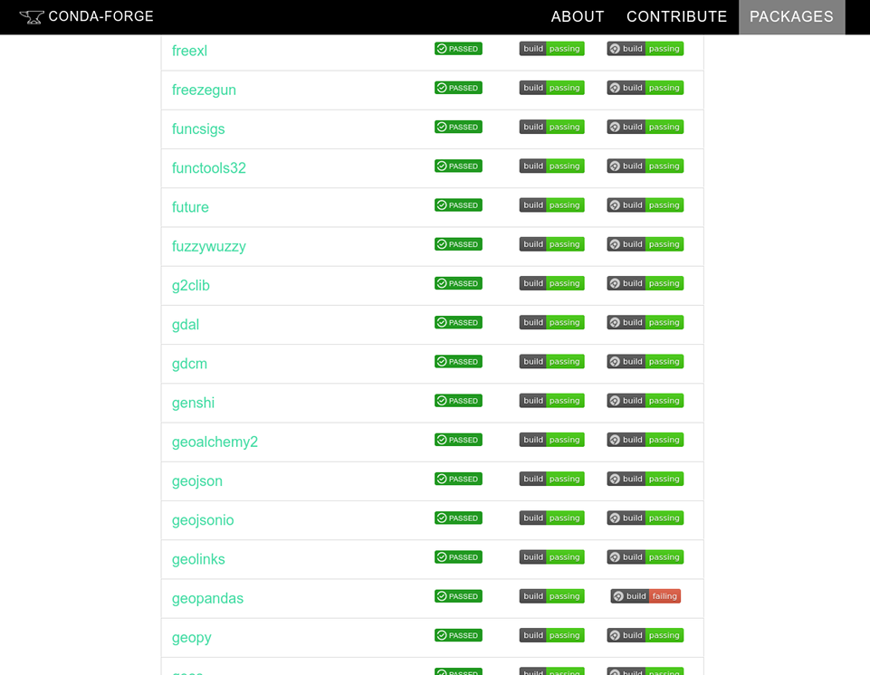
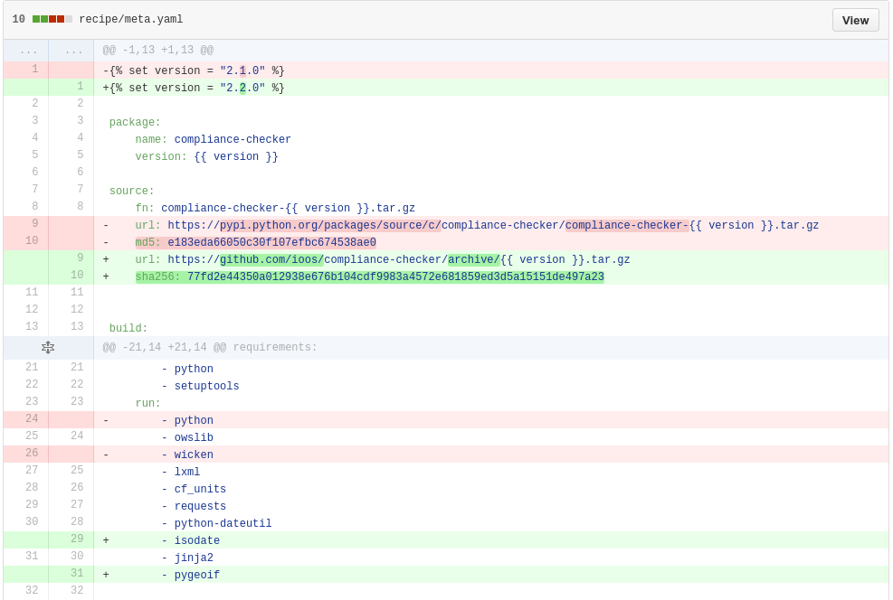
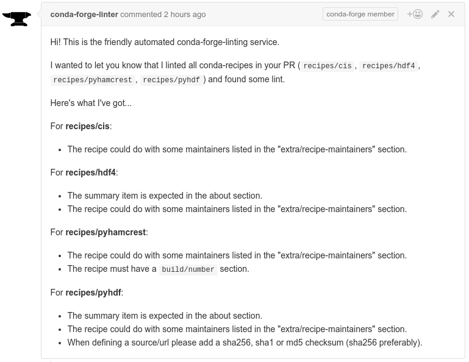
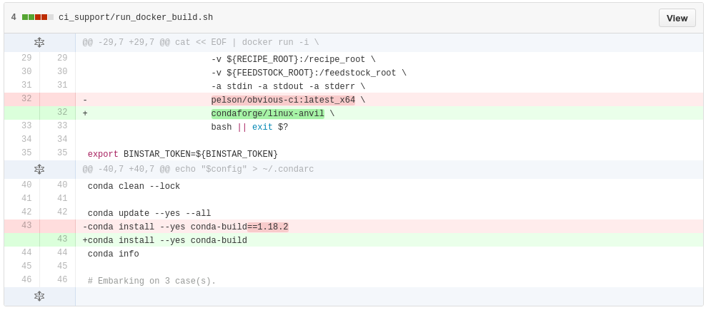
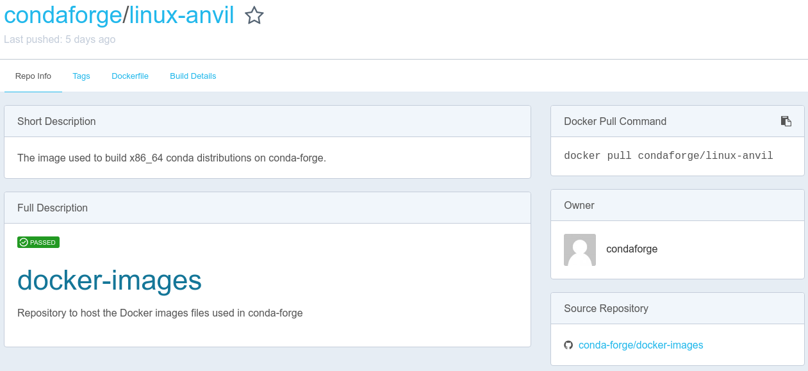
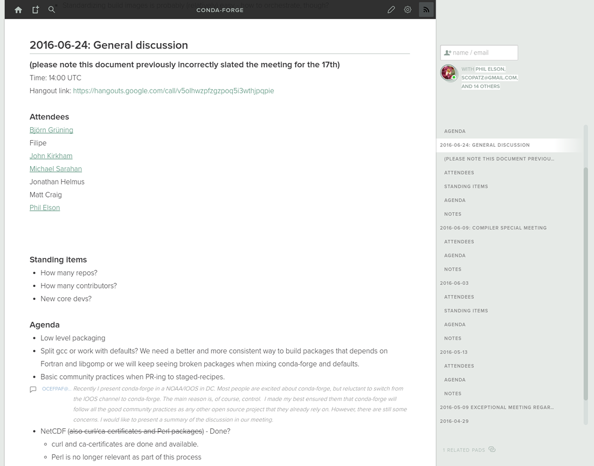

% How to [conda-forge](https://conda-forge.github.io/)
% Filipe Fernandes
% 2016 SciPy

---

# How to help the community in
## 4 simple steps

> - Don't ask what conda-forge can do for you
> - Ask what you can do for conda-forge ;-)

# 1) Browse for packages



https://conda-forge.github.io/feedstocks.html

# 2) Open issues


# 3) The recipe exists
## but it is outdated.



# 4) Cannot find a package?
## Send a PR!

> - The point of entry is [staged-recipes](https://github.com/conda-forge/staged-recipes)
> - The tooling lives in [conda-smithy](https://github.com/conda-forge/conda-smithy)
> - But what you really need is `conda smithy recipe-lint`
> - Remember to check the [example](https://github.com/conda-forge/staged-recipes/blob/master/recipes/example/meta.yaml) recipe before sending the PR

# The [linter](https://github.com/conda-forge/conda-forge-webservices/tree/master/conda_forge_webservices) in action




# Extra 0: forge like pro
### `conda smithy rerender`




# Extra 1: forge like a ninja
### `docker pull condaforge/linux-anvil`



# Extra 2: forge like boss



# Add your github here

```shell
183amir aebrahim ajdawson ajgpitch aleksandervines alexbw
alimanfoo almarklein amueller apdavison arokem asmeurer
astrofrog basepi bekozi bjlittle blink1073 bollwyvl
borntyping brandon-rhodes Cadair ccordoba12 ceholden certik
ChrisBarker-NOAA chrismattmann cmutel conda-forge-admin
conda-forge-linter conda-forge-status croth1 daf
dan-blanchard danclewley DanCodigaMWRA danielballan
danielfrg ddunwoody dfm dgursoy dharhas dkillick domoritz
dopplershift drkjam duncanwp EelcoHoogendoorn ellisonbg
emiliom ericdill eriknw fabianp frol ghisvail gidden
gillins goanpeca grantjenks grlee77 inducer irmen isuruf
ivoflipse jakevdp jakirkham janschulz jasongrout jcb91
jcrist jdhughes-usgs jhamman jjhelmus jni jochym
jorisvandenbossche jreback jschueller jsiirola Juanlu001
karlmsmith kayhayen kmuehlbauer Korijn koverholt kwilcox
lbdreyer lesteve licode marcharper mariusvniekerk
martinandersen martindurant MatthieuDartiailh Maxyme
mcg1969 mdboom melund mingwandroid minrk mjuric
mmysinger morganfainberg mrocklin msarahan msiemens
mwcraig newville ngoldbaum nicoddemus nmadhok Nurdok
ocefpaf ogrisel Ohjeah os patricksnape pelson philippjfr
phobson pmlandwehr pydanny quintusdias ravescovi rgbkrk
rgommers rhattersley rhiever richafrank rokuingh samuelgarcia
scopatz shoyer sigmavirus24 stefan-balke stuarteberg
SylvainCorlay tacaswell takluyver tbeu TomAugspurger tschoonj
twiecki vamega wesleybowman wesm whart222 wholmgren willingc
wjakob Xarthisius
```

# How to find [us](https://github.com/orgs/conda-forge/people)?

[Github](https://github.com/conda-forge)

[Gitter](https://gitter.im/conda-forge/conda-forge.github.io)

[Mailing list](https://groups.google.com/forum/#!forum/conda-forge)

. . .

Help us to review new packages [staged-recipes](https://github.com/conda-forge/staged-recipes)!

. . .

And catch Phil Elson's talk tomorrow:

`Community Powered Packaging with conda-forge`
`(3:30-4:00)`
